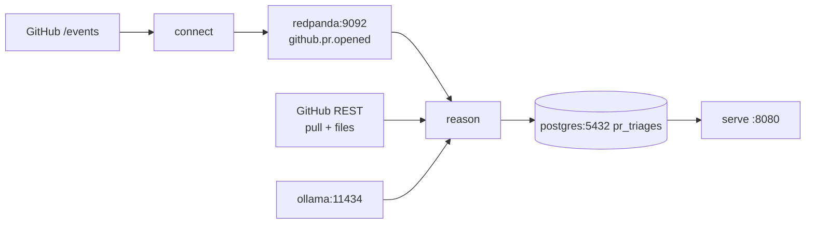

# Architecture

Connect polls GitHub and produces `github.pr.opened`. Go `reason` consumes, fetches the PR, classifies, upserts Postgres. Go `serve` reads that table. The UI does not classify.

Connect is plumbing: filter, project, cache, produce. No LLM, no Connect `branch`. Classification uses **fetched body and files**, not title or event metadata.

`.cursor/spec/` is the rebuild kit. It still describes host-only Ollama and tasks (`topic:consume`, `db:psql`) that are not in `Taskfile.yml`. This file matches the running Compose.



## How the containers connect

Default Compose network. DNS = service name. Two Kafka listeners: **internal `redpanda:9092`**, advertised external `localhost:19092`. Host clients use `19092`. `9092` is not published.

```
connect  --GET------>  api.github.com   (/events, 3 pages / 30s)
connect  --produce-->  redpanda:9092
reason   --consume-->  redpanda:9092
reason   --GET------>  api.github.com   (pull + files)
reason   --POST----->  ollama:11434     (/v1/chat/completions)
reason   --upsert--->  postgres:5432
serve    --SELECT--->  postgres:5432    (no Kafka, no GitHub, no Ollama)
```

| Service | Role | Host | Wait for |
| --- | --- | --- | --- |
| `redpanda` | Kafka, `--mode=dev-container`, 512M | `19092` | |
| `postgres` | `triage`/`triage`/`triage` | `5432` | |
| `ollama` | HTTP API | `11434` | model listed (`ollama list`) |
| `ollama-pull` | one-shot `ollama pull`, `network_mode: service:ollama`, `restart: no` | | |
| `connect` | ingest YAML | none | `redpanda` healthy |
| `reason` | worker, distroless, no port | none | `redpanda` + `postgres` + `ollama` **healthy** |
| `serve` | HTML + JSON, distroless | `8080` | `postgres` healthy |
| `console` | profile `debug` | `8081` | `redpanda` |
| `pgadmin` | profile `debug`, no login, server **triage** | `8082` | `postgres` |

`task infra:up` = `docker compose --profile debug up -d --build`. Plain `docker compose up` is the takehome path (no Console/pgAdmin).

`connect` does not wait on Ollama. It will produce while `reason` is still blocked on the model pull. Empty UI during first boot is normal.

## Connect

Every 30s: GET `/events?per_page=100&page=` `{1,2,3}` (rate limit 3/30s), explode the JSON **array**, keep `type==PullRequestEvent` and `payload.action` in `["opened"]`, project, cap `CONNECT_BATCH_LIMIT` (default 1), memory-cache `event_id`, produce.

`/events` is ~300 mixed events. Same `id` reappears; cache is required. Opened PRs are rare. Empty topic + `task github:events` showing `[]` means a quiet firehose, not a broken pipeline.

Topic JSON: no title (`/events` truncates). `pr_url` is the REST URL (`.payload.pull_request.url`). `reason` replaces it with `html_url` after GET pull.

```json
{
  "event_id": "18976100919",
  "repo": "owner/name",
  "pr_number": 42,
  "pr_url": "https://api.github.com/repos/owner/name/pulls/42",
  "author": "login",
  "action": "opened",
  "created_at": "2026-08-26T17:06:33Z",
  "public": true
}
```

Headers: `Bearer ${GITHUB_TOKEN}`, non-empty `User-Agent`, `Accept: application/vnd.github+json`. Cache is in-process, 24h TTL; Connect restart can re-produce (upsert is idempotent). Topic auto-creates on first produce.

Allowlist is one Bloblang list. Cap is `batch_index() >= N` **before** cache, so later ticks can still pick other ids still in the window.

## Reason

Group `pr-triage-worker`, `franz-go`, auto-commit off, new groups from start. Handle serially, upsert, then commit.

| Failure | Ack? |
| --- | --- |
| Postgres down | No. Process exits; Compose restarts; redelivery |
| GitHub 4xx/5xx or model/parse exhausted | Yes. Row `unknown`, `source=fallback`, `error` set |
| Bad topic JSON or missing ids | Yes. No row |

1. Enrich: `GET /repos/{owner}/{repo}/pulls/{n}` and `.../files?per_page=N`. Token + User-Agent. `N` = `REASON_MAX_NUMBER_FILES` (20). Each patch cut at `REASON_MAX_FILE_PATCH_SIZE` (4000), heading marked `[truncated]`. First files page only. Binary files often have no patch.
2. Empty body and zero files: `unknown` / `fallback`. No LLM.
3. Rules (list, first match, filenames only): all `.md` → `docs`; all lockfile basenames → `dependency-bump`. Empty list, `.mdx`, `go.mod` without `go.sum`, mixed trees: no match. `source=rule`, confidence null.
4. Models: `POST {OLLAMA_URL}/v1/chat/completions`, temperature 0. Default `http://ollama:11434`, `llama3:8b`.
   - Summarize → `{affected_area, summary}` (title, fenced body, totals; no patches).
   - Classify → `{category, confidence, rationale}` (summary + patches).
   - Parse first `{...}`, normalize label. 3 attempts/step then `unknown`. Classify retries append `classify_repair.txt`. Summarize retries resend the same prompt.
   - Confidence `< CONFIDENCE_THRESHOLD` (0.6): one extra classify, persist even if still low. No re-summarize, no force `unknown`. Threshold is not in the prompt.
5. Upsert `pr_triages` PK `event_id`.

Labels: `security | feature | refactor | docs | dependency-bump | unknown`. `source`: `rule | model | fallback`.

Lockfile set: `package-lock.json`, `yarn.lock`, `pnpm-lock.yaml`, `npm-shrinkwrap.json`, `Cargo.lock`, `go.sum`, `poetry.lock`, `Pipfile.lock`, `Gemfile.lock`, `composer.lock`, `bun.lock`, `bun.lockb`.

Prompts: `internal/reason/prompts/` via `//go:embed` (rebuild `reason` to change). Dumps: `.local/reason-logs/{event_id}/`.

## Serve and Postgres

`serve` is read-only HTTP.

- `GET /` table, cap `SERVE_LIST_CAP` (20). Window = newest N by `classified_at`; `sort`/`dir` reorder that window.
- `GET /api/triages` same rows + `stats` over **all** rows (`total`, `pending` = not `model`/`rule`, `model`, `rule`).
- `GET /healthz` Postgres ping.

Unauthenticated. Unknown `sort`: 400 JSON, default HTML. `public`, `affected_area`, `summary` are JSON-only.

`db/schema.sql` runs once on an empty volume. Schema change: `task infra:down:clean`. Upsert `ON CONFLICT (event_id)`. `created_at` is RFC3339 from the topic, never a raw epoch. Postgres 18 volume path is `/var/lib/postgresql`.

## Env

| Var | Default | Where |
| --- | --- | --- |
| `GITHUB_TOKEN` | required | connect, reason, `github:*` tasks |
| `CONNECT_BATCH_LIMIT` | 1 | connect |
| `OLLAMA_URL` | `http://ollama:11434` | reason |
| `OLLAMA_MODEL` | `llama3:8b` | ollama-pull, reason |
| `REASON_MAX_NUMBER_FILES` | 20 | reason |
| `REASON_MAX_FILE_PATCH_SIZE` | 4000 | reason |
| `CONFIDENCE_THRESHOLD` | 0.6 | reason |
| `SERVE_LIST_CAP` | 20 | serve |

## Common issues

1. **No `.env` / empty token.** `connect` has `env_file: .env` (Compose fails if missing). `task setup` copies the example. `task infra:up` refuses an empty token; bare `docker compose up` does not, then Connect 401s. GitHub also 403s an empty User-Agent. Anonymous `/events` is 60/hr; this pipeline does 3 GETs/30s.

2. **First boot is the 4.7GB pull.** `reason` waits on `ollama list | grep $OLLAMA_MODEL`. Healthcheck budget is ~5m start + 30×10s. `ollama-pull` will not retry (`restart: no`). If pull raced Ollama's listen, recreate `ollama-pull`. `serve` can be up the whole time with an empty table.

3. **Port 11434.** Compose binds it. Ollama.app already on 11434 → bind failure. `OLLAMA_URL=http://127.0.0.1:11434` in `.env` is loopback **inside** `reason`. Host Metal: `http://host.docker.internal:11434` and do not publish Compose on 11434. Default is Compose Ollama.

4. **Changing `OLLAMA_MODEL`.** `ollama-pull` already exited and will not run again. Recreate it (`docker compose up --force-recreate ollama-pull`) and recreate `reason` so it picks up the new name. If you recreate `ollama` first, its healthcheck greps the new name and `reason` waits until the pull finishes. If you only bounce `reason`, Ollama 404s the missing tag and rows land `unknown`.

5. **Empty UI after a healthy stack.** `/events` rarely has `opened`. `task github:events`, or Console `http://localhost:8081/topics/github.pr.opened/` (needs `--profile debug`). Cap=1 means at most one live PR per 30s.

6. **Model rows lag.** Docker Ollama on Mac is CPU. 180s timeout per call. Summarize + classify + retries can block the consumer for minutes. Rule hits show up first. `task logs SERVICE=reason`.

7. **`unknown` will not heal on the next poll.** Cache dropped that `event_id`; the worker already acked. Replay the JSON. Keeping the Redpanda volume while wiping Postgres yields an empty table and a consumer that thinks it is caught up.

8. **Schema not updating.** Init scripts run once. Wipe volumes.

9. **No shell in `reason`/`serve`.** Distroless. Logs and `.local/reason-logs/`, not `docker exec`. Prompts are compile-time: `--build reason`.

10. **RAM.** Redpanda is capped at 512M. `llama3:8b` wants several GB in the Docker VM.

Inspect: Console `:8081`, pgAdmin `:8082`, `task logs SERVICE=connect|reason|serve`, `docker compose exec -T postgres psql -U triage -d triage`, `rpk` in Redpanda with `-X brokers=redpanda:9092`.
