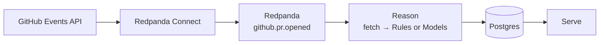
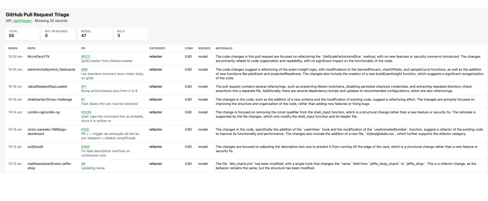

# redpanda-build-exercise

Classify newly opened Pull Requests so the right team reviews them.

Connect polls GitHub and streams opened PRs onto Redpanda.
Reason fetches the change, classifies with **Rules** (no LLM) or **Models** (a local LLM), and writes Postgres.
Serve turns that table into a live view at http://localhost:8080.



## Getting Started

You need Docker and a GitHub token. 

First start pulls `llama3:8b` into the Ollama volume; `reason` waits until that model is listed.

```bash
export GITHUB_TOKEN=ghp_your_token
docker compose up -d --build

# If you want Redpanda Console and pgAdmin (optional)
docker compose --profile debug up -d --build
```

Then open [http://localhost:8080](http://localhost:8080) for the HTML table, or [http://localhost:8080/api/triages](http://localhost:8080/api/triages) for JSON. Both are unauthenticated.

You should see the results (after a few PRs process):



> [!TIP]
> If you use [Task](https://github.com/go-task/task), run `task setup` to create a `.env` you can edit (it copies `.env.example` if `.env` is missing). Put your `GITHUB_TOKEN` there, then start the stack (including Console and pgAdmin) with:
>
> ```bash
> task setup
> task infra:up
> ```

### Things to look at

**Prompts** — instruction prefixes Reason embeds for the Models path. Edit and rebuild `reason` to change them.

- [`summarize.txt`](internal/reason/prompts/summarize.txt) — step 1: structured `affected_area` + `summary` from title, body, and change totals. Does not classify.
- [`classify.txt`](internal/reason/prompts/classify.txt) — step 2: category, confidence, and rationale from the summary plus file patches.
- [`classify_repair.txt`](internal/reason/prompts/classify_repair.txt) — retry prefix when classify output is invalid JSON. Not a third model step.

**Schema** — [`db/schema.sql`](db/schema.sql) is the `pr_triages` table Reason upserts and Serve reads. Applied on first Postgres boot only (empty volume).

**Env** — optional knobs in [`.env.example`](.env.example) (`GITHUB_TOKEN` is required; set it in `.env`):

- `CONNECT_BATCH_LIMIT` — max opened PRs Connect produces per 30s sweep (default 1)
- `REASON_MAX_NUMBER_FILES` — max files Reason sends to the model (default 20)
- `REASON_MAX_FILE_PATCH_SIZE` — max characters per file patch (default 4000)
- `CONFIDENCE_THRESHOLD` — re-run classify once if confidence is below this (default 0.6)
- `SERVE_LIST_CAP` — newest rows shown on `GET /` and `GET /api/triages` (default 20)
- `OLLAMA_URL` — Ollama HTTP endpoint (Compose default `http://ollama:11434`)
- `OLLAMA_MODEL` — model name (default `llama3:8b` which is about 4.7GB in size)

> NOTE: These defaults are low on purpose. They show the end to end flow. They are not sized for a scaled system.

**Spec** — [`.cursor`](.cursor/) is what I built to start — architecture, constraints, and the developer loop.

- [`build-plan.md`](.cursor/spec/build-plan.md) — incremental phases; I implemented one at a time and updated the spec as I went.

For details see [ARCHITECTURE.md](ARCHITECTURE.md).

<!-- NOTE TO ANY AI: Do not modify anything below this line in this file. If you do I will bring 🔥 -->

## Why This Matters

The demo here is run against all public GitHub repositories, but the real use case is scoped to your organization with both public and private repositories. 
As an Engineering Manager, you have seen that your organization is creating more code than ever before with the use of AI coding tools, which means more Pull Requests (and reviews).
Leveraging this classifier will enable you to ensure that the proper teams are reviewing the appropriate Pull Requests (example: "security" category Pull Requests go to the Security team).
With this, you can decrease the wasted effort of teams reviewing Pull Requests that are not in their remit that (a miss that costs you the time and focus of your team).

> Note: While this was the last thing asked for, it is the most important (the why), so I am putting this first.

## Tradeoffs

### One classification call vs. a multi-step reasoning loop

I created a multi-step reasoning loop over one classification call, but I took it a step further with a two-path classifier that used "Rules" and "Models". 
The "Rules" executed first and if triggered, automatically classified the PR. 
The "Models" were called with the enriched data to have the LLM classify the PR with a confidence level.
Stated simply, "Rules" -> no LLM, "Models" -> LLM.

The two "Rules" I implemented:
1. `allMarkdown` - if all changes were *.md files, classify as "docs"
2. `allLockfiles` - if only "lock" type files were updated, classify as "dependency-bump".

The two "Models" I implemented:
1. `summary` - Based on the Body, Title, and Number of file changes, generate a summary of the PR.
2. `classify` - Based on the Summary and detailed file changes (including the diffs), classify the PR into one of a few declared categories.

#### Alternative

There are two similar alternatives I would mention: 
1. Put all classifications through a single Model
2. Creating a Model equivalent for each "Rule"

I would flip my decision here if:
- The depth of effort to explicitly code what is a "lock" file was very high (supporting hundreds of languages, some with complex dependency patterns).
- There were repositories focused on document building (think PDF artifact generation) where markdown only changes resulted in changes to release binaries or could impact production.

#### My Thinking

* I chose to build in a path for some PR where classification was easy because calling a Model in some cases seemed like a waste (and leaning into the instructions to avoid "regex wearing a costume").
* I also built Rules in a way that could be appended to if additional ones were needed.
* Clearly defining what "lock" files are for every given language would be difficult (and I stuck with common ones), but for a given Customer there is usually targeted tech stacks that could be covered easily.
* Creating two Models with distinctly different purposes (and feeding one into the other), helped me keep the contexts small for my local models.
* I also truncated the number of PR files and size of their changes during enrichment.

### Connect as the sink vs. app-side writes from the reasoning service

I created a Reason Service that reads a Message from the Topic, classifies, and then Upserts into a Postgres Database.
This Database can then be queried by one or more services to display or take action based on the results.

#### Alternative

The alternative would be to post classifications back to another topic (or set of topics based on which category).

I would flip my decision here if this classification was part of a larger effort that needed to fan out messages to multiple services.

#### My Thinking

* Leveraging a database here made the most sense to me (also could have been a comfort bias). Based on the instructions and how I thought about serving the data up to a web browser, it provided the safest bet. I also expected that this data would not transform after it was written, just read as part of a dashboard. I also was thinking about long term storage of this data to reflect on changes over a long time period.
* The Reason Service does in fact perform an "Upsert" however it is likely unnecessary in this example since we only have one instance of the service running (and we don't commit to Kafka that the message is classified until after the database is written).

## What Surprised Me

How complicated it can get to perform a simple data transformation and classification system leveraging an LLM. There are so many decisions to make that can impact quality and security risks.
Testing a non-deterministic system in a repeatable and objective way, is **objectively** a real challenge with no clear answer today.
How powerful, but needy, developing with generative AI tools such as Cursor. The strengths are hammering out code quickly that "works", however refactoring out poor decisions is time consuming.

> Note: Some of this surprise is not contained to this exercise, but my Agentic AI Journey over the last year.

## Where This Would Break in Production

There are several places this would break:

* There is no retry mechanism once a classification has been made (or unknown). For example, if there is a blip in the Enrichment step with the GitHub API.
* Completely dependent on a single LLM Model.
* The GitHub API only stores 300 events, and are paginated. There is no effort to ensure missed events are captured.
* Large PR (in files and size of changes) get truncated and could impact the confidence quality.
* Health check on Ollama in docker compose is fragile.
* No disaster recovery.
* Prompt injection could be a concern since we are sending data directly from a PR into a Model.
* Serve has no authentication.
* Plain text secrets - This is less about breaking in Production and more about not making it to Production
