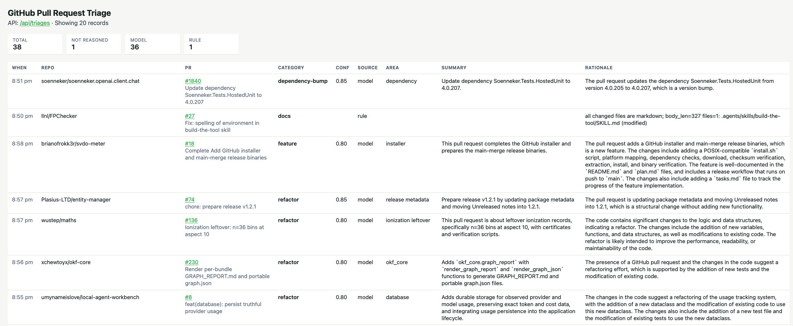

# redpanda-build-exercise

This repo is a local pull-request triage pipeline. Redpanda Connect polls GitHub’s public events API, keeps only newly opened PRs, projects a small JSON record, caches on `event_id`, and produces to `github.pr.opened`. A Go worker (`reason`) consumes that topic, fetches the PR body and changed files, classifies with deterministic rules when the file list is enough (all `.md` → `docs`, all lockfiles → `dependency-bump`) or otherwise a two-step local Ollama loop (summarize, then classify), and upserts into Postgres. A second Go service (`serve`) only reads that table and hosts an HTML table plus JSON at `http://localhost:8080`.

## Getting Started

You need Docker and a GitHub token. 

First start pulls `llama3:8b` into the Ollama volume; `reason` waits until that model is listed.

```bash
export GITHUB_TOKEN=ghp_your_token
docker compose up -d --build

# If you want Redpanda Console and pgAdmin (optional)
docker compose --profile debug up -d --build
```

Then open [http://localhost:8080](http://localhost:8080).

You should see the results (after a few PRs process):



### Alternative Approach

If you use [Task](https://github.com/go-task/task), put the token in `.env` (`task setup` copies `.env.example` if that file is missing) and start the stack — including Console and pgAdmin — with:

```bash
task infra:up
```

## Why This Matters

The demo here is run against all public GitHub repositories, but the real use case is scoped to your organization with both public and private repositories. 
As an Engineering Manager, you have seen that your organization is creating more code than ever before with the use of AI coding tools, which means more Pull Requests (and reviews).
Leveraging this classifier will enable you to ensure that the proper teams are reviewing the appropriate Pull Requests (example: "security" category Pull Requests go to the Security team).
With this, you can decrease the wasted effort of teams reviewing Pull Requests that are not in their remit that (a miss that costs you the time and focus of your team).

> Note: While this was the last thing asked for, it is the most important (the why), so I am putting this first.

## Tradeoffs

### One classification call vs. a multi-step reasoning loop

I created a multi-step reasoning loop over one classification call, but I took it a step further with a two-path classifier that used "Rules" and "Models". 
The "Rules" executed first and if triggered, automatically classified the PR. 
The "Models" were called with the enriched data to have the LLM classify the PR with a confidence level.
Stated simply, "Rules" -> no LLM, "Models" -> LLM.

The two "Rules" I implemented:
1. `allMarkdown` - if all changes were *.md files, classify as "docs"
2. `allLockfiles` - if only "lock" type files were updated, classify as "dependency-bump".

The two "Models" I implemented:
1. `summary` - Based on the Body, Title, and Number of file changes, generate a summary of the PR.
2. `classify` - Based on the Summary and detailed file changes (including the diffs), classify the PR into one of a few declared categories.

#### Alternative

There are two similar alternatives I would mention: 
1. Put all classifications through a single Model
2. Creating a Model equivalent for each "Rule"

I would flip my decision here if:
- The depth of effort to explicitly code what is a "lock" file was very high (supporting hundreds of languages, some with complex dependency patterns).
- There were repositories focused on document building (think PDF artifact generation) where markdown only changes resulted in changes to release binaries or could impact production.

#### My Thinking

* I chose to build in a path for some PR where classification was easy because calling a Model in some cases seemed like a waste (and leaning into the instructions to avoid "regex wearing a costume").
* I also built Rules in a way that could be appended to if additional ones were needed.
* Clearly defining what "lock" files are for every given language would be difficult (and I stuck with common ones), but for a given Customer there is usually targeted tech stacks that could be covered easily.
* Creating two Models with distinctly different purposes (and feeding one into the other), helped me keep the contexts small for my local models.
* I also truncated the number of PR files and size of their changes during enrichment.

### Connect as the sink vs. app-side writes from the reasoning service

I created a Reason Service that reads a Message from the Topic, classifies, and then Upserts into a Postgres Database.
This Database can then be queried by one or more services to display or take action based on the results.

#### Alternative

The alternative would be to post classifications back to another topic (or set of topics based on which category).

I would flip my decision here if this classification was part of a larger effort that needed to fan out messages to multiple services.

#### My Thinking

* Leveraging a database here made the most sense to me (also could have been a comfort bias). Based on the instructions and how I thought about serving the data up to a web browser, it provided the safest bet. I also expected that this data would not transform after it was written, just read as part of a dashboard. I also was thinking about long term storage of this data to reflect on changes over a long time period.
* The Reason Service does in fact perform an "Upsert" however it is likely unnecessary in this example since we only have one instance of the service running (and we don't commit to Kafka that the message is classified until after the database is written).

## What Surprised Me

How complicated it can get to perform a simple data transformation and classification system leveraging an LLM. There are so many decisions to make that can impact quality and security risks.
Testing a non-deterministic system in a repeatable and objective way, is **objectively** a real challenge with no clear answer today.
How powerful, but needy, developing with generative AI tools such as Cursor. The strengths are hammering out code quickly that "works", however refactoring out poor decisions is time consuming.

> Note: Some of this surprise is not contained to this exercise, but my Agentic AI Journey over the last year.

## Where This Would Break in Production

There are several places this would break:

* There is no retry mechanism once a classification has been made (or unknown).
* If there is a blip in the Enrichment step with the GitHub API.
* No health check on Ollama in docker compose.
* Completely dependent on a single LLM Model.
* The GitHub API only stores 300 events, and are paginated. There is no effort to ensure missed events are captured.
* Large PR (in files and size of changes) get truncated and could impact the confidence quality.
* No disaster recovery.
* Prompt injection could be a concern since we are sending data directly from a PR into a Model.
* Serve has no authentication.
* Plain text secrets - This is less about breaking in Production and more about not making it to Production

## Ports

Host ports come from `docker-compose.yml` (`task infra:up`). `infra:up` uses Compose profile `debug`, so Console and pgAdmin start with the stack. Plain `docker compose up` does not start those two.

| Host | Service | Use |
| --- | --- | --- |
| `localhost:8080` | `serve` | HTML table + JSON API (`/api/triages`, `/healthz`). Started by `task infra:up` |
| `localhost:5432` | `postgres` | PostgreSQL (`triage` / `triage` / `triage`). Browse with pgAdmin |
| `localhost:19092` | `redpanda` | Kafka API **from the host** |
| `localhost:11434` | `ollama` | Ollama HTTP API. Started by `task infra:up` (`ollama-pull` fetches `OLLAMA_MODEL`) |
| `localhost:8081` | `console` | [Redpanda Console](http://localhost:8081) — browse topics and messages |
| `localhost:8082` | `pgadmin` | [pgAdmin](http://localhost:8082) — browse Postgres. Server **triage** is pre-registered (no login) |

`connect` has **no host port**. It polls GitHub and produces to Kafka on the Compose network (`redpanda:9092`). Logs: `task logs SERVICE=connect`. `task infra:up` starts it with the rest of Compose. Needs `GITHUB_TOKEN` in `.env`.

`reason` has **no host port**. It consumes `github.pr.opened`, GETs PR body/files, applies Rules or Summarize→Classification via Compose Ollama (`http://ollama:11434`), and upserts Postgres. Logs: `task logs SERVICE=reason`. `task infra:up` starts it with the rest of Compose. Stop just the worker: `task reason:down`. Needs `GITHUB_TOKEN` in `.env`.

`serve` only reads Postgres and hosts `http://localhost:8080`. It does not consume Kafka or call Ollama. `task infra:up` starts it with the rest of Compose. Stop just the UI: `task serve:down`.

Inside the Compose network, Kafka is **`redpanda:9092`**. Host clients use `localhost:19092`.

## Ollama

Ollama runs in Compose (`ollama` + one-shot `ollama-pull`). `task infra:up` starts both. Model name is `OLLAMA_MODEL` (default `llama3:8b`). Override in `.env`. `reason` calls `http://ollama:11434` unless `OLLAMA_URL` is set.

Host Ollama (Metal) is optional. Do not run it on `11434` while the Compose `ollama` service is up (same host port). Set `OLLAMA_URL=http://host.docker.internal:11434` in `.env`, then:

```
task ollama:up            # background ollama serve, then version + models
task ollama:logs          # tail .local/ollama.log
task ollama:check         # API only
task ollama:down          # stop whatever is listening on 11434
```

If `ollama:check` warns the model is missing: `ollama pull llama3:8b`.

## Simulate opened PRs

GitHub `/events` rarely includes `PullRequestEvent` + `opened`. Fixtures in `sim/pr-opened/*.json` are work-topic payloads (`event_id` prefix `sim-`). They are produced with `rpk`; Connect and `connect/ingest.yaml` are unchanged.

```
task sim:replay          # wipe sim Postgres rows + recreate topic, then produce fixtures
```

Browse produced messages in [Console](http://localhost:8081/topics/github.pr.opened/).

`task sim:reset` deletes `pr_triages` rows whose `event_id` starts with `sim-` and **recreates** `github.pr.opened` (all messages, not only sim). `task sim:reset:all` deletes **every** `pr_triages` row and recreates the topic. `task sim:produce` writes the JSON files onto the topic without resetting. Add files under `sim/pr-opened/`; keep `event_id` unique and `sim-` prefixed. `repo` / `pr_number` are real public PRs so a later worker GET still works. Rule fixtures: `sim-004` is markdown-only (`rust-lang/rfcs#1` → `docs`); `sim-005` is lockfile-only (`grommet/grommet-site#568` → `dependency-bump`). Both use `source=rule`. `task test` runs those rules without Docker.

After a `db/schema.sql` change, wipe the Postgres volume (`task infra:down:clean` or `docker compose down -v`) so the new columns exist. Schema is applied only on first boot of an empty volume.
